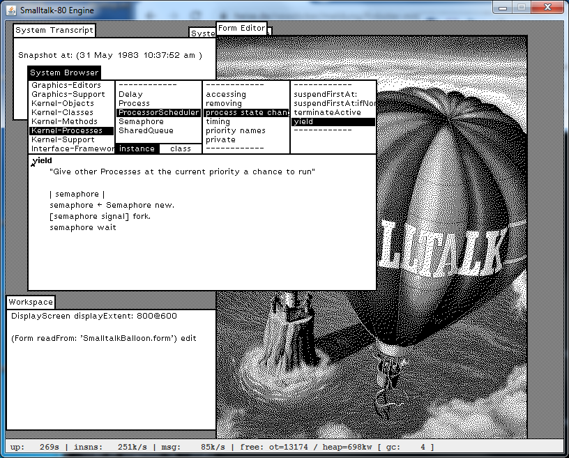
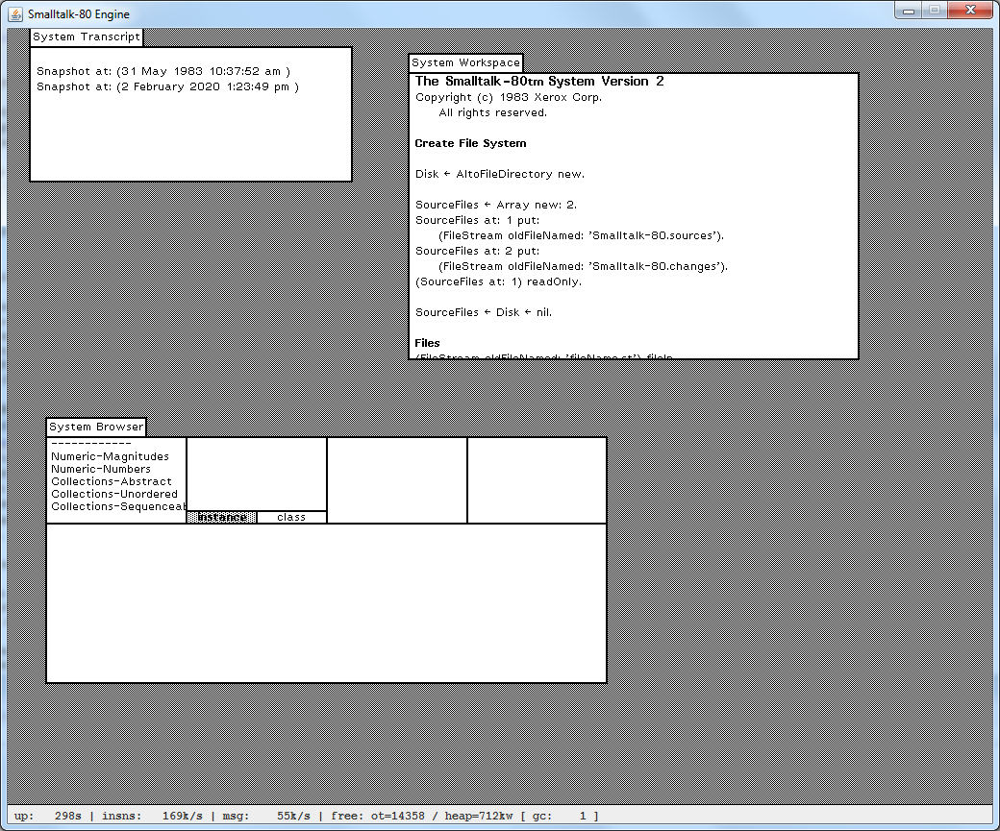
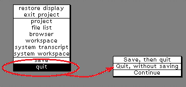
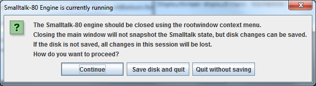

## ST80 - a Smalltalk-80 virtual machine based on the "Bluebook" specification

ST80 is a virtual machine for Smalltalk-80 as specified in the "Bluebook" (Smalltalk-80:
the Language and its Implementation, see Bibliography) implemented in Java 8.

The ST80 program allows to run the Xerox Smalltalk-80 Version 2 image found at the archive.org website
(see [Smalltalk-80](https://archive.org/details/smalltalk-80)). The archive found there seems
to be the content of an original Xerox distribution tape for Smalltalk-80, at least regarding the most
important files like the virtual memory image itself, the Smalltalk-80 source code and some trace files
indicating which instructions are executed when the image is restarted.

As the appearance dates of the Smalltalk-80 book series and the source code are all 1983 (the image file is from 1985,
but this may be due to a Unix copy operation), the idea and challenge to "resurrect" this vintage
Smalltalk version emerged, in the pure interest of preserving an important piece of computer history as usable and
experienceable item, instead of a "look at it but don't touch" museum exhibit in a glas case.    
This vintage Smalltalk environment cannot compete with any serious modern - commercial or open source - Smalltalk
implementation, which swim rings around the original 16-bit Smalltalk-80 system provided in the mentioned tape,
be it in terms of execution speed, memory (heap size, max. number of objects), technical capabilities (networking,
version management, ...), user interface (color, frameworks, ...) etc.

For most parts of the implementation, ST80 is a faithful translation to Java of the Smalltalk pseudo-code
used in the Bluebook for specifying the virtual machine, with some bugfixes. The main exception is the object memory,
which could be implemented without the hardware restrictions for the available RAM that were common when 
Smalltalk-80 was specified, allowing for a much simpler design of the at most 1 MWord (yes: 16 segments of 65536 
16-bit-words or 2 MBytes) heap memory and the 16 bit object pointers. Besides this, all required and some
optional primitives are implemented by ST80.

As the available Smalltalk image expects to run on an Alto machine for all file operations, an emulation for an
Alto harddisk was added to ST80, implementing the "vendor-specific" primitives for the Alto. This emulation uses
the same disk image format used by common Alto emulators ([ContrAlto](https://github.com/livingcomputermuseum/ContrAlto)
or [Salto](http://bitsavers.org/bits/Xerox/Alto/simulator/salto/)). The disk image contains a single disk Alto file system
which is accessed by the relevant Smalltalk classes through simulated low-level Alto hardware disk-I/O operations.    
ST80 also includes an utility for creating, loading and writing Alto disk images, list the disk content
and manipulating the disk like adding/renaming/deleting files.

In a nutshell, ST80 should allow to work "as expected" with the original image file for this vintage Smalltalk-80
Version 2 environment. The following screenshot shows the ST80 application window running the version 2 image with
a companion Alto disk where the source code for the method shown in the browser (notice the variable name and comment) and
the _SmalltalkBalloon_ picture were loaded from:



### Data files for running ST80

ST80 uses a _data file set_ of up to 3 files grouped by the common base _filename_ for a single Smalltalk
environment instance:

- _filename_`.im` is the required Smalltalk image file

- _filename_`.dsk` is the associated Alto disk image file containing the filesystem that the Smalltalk
  environment has access to; the Alto disk image file is optional, as (at least the version 2) Smalltalk environment
  can run without having access to a filesystem, however this results in some restrictions (the class browser
  shows methods without comments or the names of temporary variables by disassembling the compiled method code,
  modifications cannot be logged to a _.changes_ file, ...)
  
- _filename_`.dsk.delta` is automatically created when the Alto disk image is present and holds the disk pages
  changed by the Smalltalk environment

Depending on the presence of an Alto disk image, ST80 behaves differently for snapshots and saving changes.

**Data file set with the Smalltalk image file only**

If the data file set has only the Smalltalk image, the only way to persist modifications in the Smalltalk
environment is to create a snapshot of the environment through the background middle-button menu using the
_Save_ command or the _Quit_ command with the _Save, then quit_ option.

The new snapshot replaces the Smalltalk image file used to start ST80. Before overwriting with the new snapshot, ST80
backups the current snapshot file to a compressed file with same name and the file creation timestamp appended. For example
the first backup for the original `VirtualImage.im` will be named `VirtualImage.im-1985.11.06_12.01.05.000`,
while the new snapshot will again be named `VirtualImage.im`.

**Complete data file set with Alto disk image**

In the presence of the Alto disk image in the data file set, the Smalltalk environment in the original delivery state
must be initialized (only once) to use the disk file system by executing the following Smalltalk code:

```
Disk _ AltoFileDirectory new.

SourceFiles _ Array new: 2.
SourceFiles at: 1 put:
	(FileStream oldFileNamed: 'Smalltalk-80.sources').
SourceFiles at: 2 put:
	(FileStream oldFileNamed: 'Smalltalk-80.changes').
(SourceFiles at: 1) readOnly.
```

This Smalltalk fragment needs not be typed in a workspace, as it is available in the system workspace in the
first section **Create File System**; in the original delivery Smalltalk image, the system workspace is already
opened when the system is brought up, moreover the above text is selected by default, so a _do it_ from the
middle-button menu of the pre-opened system workspace should suffice.    
(the next sentence in the system workspace disconnects the system from the Alto filesystem, so this line should
not be included in the selection)

With the connected Alto filesystem, the Smalltalk environment automatically writes modifications to the changes
file specified in the `SourceFiles` array at the 2nd position (see above).

When ST80 terminates normally, changes to the Alto disk by the Smalltalk environment since the last snapshot
resp. since the program start are saved to the delta file in the data file set.

When a new snapshot of the Smalltalk environment is created, ST80 first backups the current file data set
into an archive ZIP file named _filename_-_timestamp_.ZIP before creating the new data file set, consisting
of the new snapshot and a full save of the Alto disk (i.e. only the new `.dsk` disk image without delta file).

Remark:    
when a snapshot is requested by the user, the Smalltalk system asks for the name of the snapshot, proposing
_snapshot_ as default name. The Smalltalk system uses the given name for creating `.im` and `.changes` files in
the Alto file system (if necessary) and informs the virtual machine about the new snapshot name. The content of the
current changes file is copied in the Alto filesystem to the new one and Smalltalk will log further changes to the new
change file. As ST80 does not write the snapshot into the Alto filesystem (saving space in this resource restricted to
about 2.5 MBytes), it will create the new data file set in the local file system with this name as common filename
(and possibly backup an existing file set with same name).    
However, the Smalltalk system is not symmetric regarding to the snapshot name: if the name is defaulted (i.e. _snapshot_
is simply confirmed) while a different snapshot name was last used (e.g. _works_), then the Smalltalk system will inform the
virtual machine about the new name, but will still continue to use the current change file instead of switching to
the new one.    
For this reason and as disk space is no longer a restriction these days, it could be a good practice to stick with the
default snapshot name and copy the whole data file set into a new directory (preserving the default name) if a new
snapshot branch is necessary.

### A tour through the ST80 sample environment

Besides the ST80 source code and the executable jar `st80vm.jar`, the Gitub project also contains the archive
`sample-env.zip` containing a ready to run Smalltalk-80 Version 2 sample environment.

After unpacking the archive, the new subdirectory `sample-env` contains the following items:

- the subdirectory `archive.org` with a copy of the Smalltalk-80 tape as found at the `archive.org` website

- the subdirectory `altodisk-files` containing files for creating an Alto disk image file from scratch. These are

  -- the original `Smalltalk-80.sources` file from the Smalltalk-80 tape,
  
  -- a handcrafted initial `Smalltalk-80.changes` file,
  
  -- a set of pictures (`*.form`) taken from the Smalltalk-80 DV6 floppies for Xerox 1186/6085 found at [Bitsavers](http://bitsavers.org/bits/Xerox/1186/1186_Smalltalk-80_DV6_Dec87.zip)
  (see also **Remarks and limitations** below)
     
  -- scripts for creating the minimal Alto disk image (`build-snapshot-disk.cmd/.sh`) as well as an Alto disk image
    including the `*.form` pictures (`build-snapshot-disk-with-forms.cmd/.sh`)

- a data file set with base filename `snapshot` consisting of the original Smalltalk-80 Version 2 memory image (renamed
  from `VirtualImage` to `snapshot.im`) and an Alto disk Image including the pictures; this environment was started,
  connected with the Alto disk (see above), the display resized to 1024x808, the original viewers reshaped to use the larger
  display and then a new snapshot of the environment was taken.
  
- the archive `snapshot-2020.02.02_13.23.49.204.zip` created by the snapshot action and containing the original state
  of the Smalltalk-80 environment (i.e. unconnected to the Alto disk, display size 640x480 as delivered originally)
  
- a set of scripts to simplify running ST80:

  -- `st80.cmd` resp. `st80.sh` to run ST80 and specify the environment and options on the command line
  
  -- `st80x.cmd` resp. `st80x.sh` to directly run the `snapshot` environment including all options for the western european time zone
  
For a quick start, enter the `sample-env` directory and enter `st80x` resp. `./st80x.sh` in a command shell; the following
window should open (here on Windows):



To shut down the Smalltalk environment, move the mouse to a free place on the gray background and press the middle mouse button.
The following command menu opens, select _Quit_ (probably already under the mouse position and therefore selected), which
opens the follow-up menu for selecting how to leave the system (where _Save_ means to create a snapshot first):



For any further explorations, the "Orange book" (see the Bibliography section) will be useful to learn how to use and program with
the Smalltalk-80 environment.

### Running ST80

##### Requirements

A Java 8 (or newer) runtime on a decent window system is needed to run ST80.

Having a hardware 3-button mouse button attached to system is recommended, as Smalltalk-80 is very mouse centric compared to
modern user interfaces and defines interactions with the UI objects in terms of 3 mouse keys.

Smalltalk-80 version 2 expects a standard english keyboard, so any international keyboard should be able to generate
the necessary input. However some specific key mappings should be known:

- the left arrow (assignment) is equivalent to the '`_`' key

- the up arrow (return value from message) is equivalent to the '`^`' key

- the return or enter key generates the CR code (carriage return, the line-end code for Smalltalk-80)

- the _INS_ key (_Einfg_ on a german keyboard) generates the LF code (linefeed)

- some non-ASCII keys on a german keyboard are mapped to the key at the same place on an US-english keyboard
  (e.g. '`ö`' becomes '`[`', '`ä`' becomes '`]`' etc.)

##### Invoking ST80

The file `st80vm.jar` is an executable jar which runs the ST80 interpreter, so ST80 can be invoked
directly with:

```
java -jar st80vm.jar ...
```
The scripts `st80.cmd` and `st80.sh` (for Windows resp. Unixoids) in the `sample-env` archive/directory simplify the
program invocation.

ST80 has the following program parameters:

- `imagename[.im]` _required_    
  the name of the Smalltalk image and optionally accompanying Alto disk image file(s) in the data file set.
  The extension `.im` of the image file can be omitted on the command line, the image filename must however
  have this extension.    
  _imagename_ specifies the name of the name on the data file set, consisting of the required virtual memory
  image, the optional Alto disk image and possibly the delta file for the Alto file system.

- `--statusline` _optional_    
  add the status line at the bottom of the ST80 application window
  
- `--stats` _optional_    
  issue some statistical data collected during the session when ST80 ends normally
  
- `--timeadjust:nn` _optional_    
  add _nn_ minutes to GMT to correct time in Smalltalk (positive values for east).    
  Background: the Smalltalk-80 Version 2 image reads GMT from the virtual machine, but hardcoded-ly
  adjusts local time to California time (i.e. Xerox-PARC time) and uses this for all time operations.
  This parameter modifies the GMT value generated to get a different local time computation, the value 540
  produces western european non-DST local time.

The status line added to the ST80 window with the `--statusline` parameter is present in the above
screenshots. The values in the status line are updated about 3 times per second. `uptime` is the runtime
of the program in seconds, `insns` is the average execution rate for Smalltalk instructions since the
last status update in 1000 instructions per second, the `msg` figure is the average message send rate
in 1000 messages per second. Both average values depend on the current activity in the Smalltalk environment
and vary over time as ST80 tries to reduce real CPU usage by throttling the execution if the Smalltalk
environment seems to be idle (see below). `free ot` gives the number of free object table entries,
`free heap` gives the free heap space in 1024 words units. `gc` is the number of compacting garbage
collections since program start.

An ST80 session is terminated _normally_ in the following ways:

- through the middle-button menu on the Smalltalk background, selecting the _Quit_ command and then
  either _Save, then quit_ (first writing a snapshot) or _Quit, without saving_    
  in both cases, changes to the Alto disk are saved to the delta file
  
- by closing the ST80 main window, which opens the following confirmation dialog, allowing to continue
  with the ST80 session, to terminate the session with saving the Alto disk changes to the delta file
  or to quit without saving anything:    
  
  
- if ST80 encounters an internal error (resulting in a Java stacktrace written to the console),
  the ST80 session is aborted, but the changes to the Alto disk are written to the delta file (if possible),
  so lost modifications may be recovered with the Smalltalk mechanisms

The ST80 session can be terminated _abnormally_ with Ctrl-C in the console where ST80 was started or
by killing the ST80 Java process: in this case no changes to the Alto disk are saved.

When the option `--stats` is given, ST80 writes some statistical data to the console when the
program terminates normally:

```
## terminating ST80, cause: primitiveQuit invoked
uptime: 404826 ms , total instructions: 1027015275 (avg: 2536k/s , max: 56182k/s)
messages as :: smalltalk: 85154708 , primitive: 56667506 , specialPrimitive: 85743928 (total: 227566142 , avg: 562k/s , max: 4468k/s)
method cache :: hits: 130043293 , fails: 11725179 , resets: 5 (total: 141768472 , hit-%: 91,0)
```

The `avg` values give the corresponding average over the runtime of the program, the `max` values give
the respective peak value issued in the status line of the main window (be it shown or not).

### Creating and manipulating Alto disk images

ST80 brings a built-in utility program for handling Alto disk images (which may also be useful when working
with Alto emulators like ContrAlto or Salto).

The utility is invoked with the scripts `altodisk.cmd` or `altodisk.sh` (for Windows resp. Unixoids),
which run the ST80 class `dev.hawala.st80vm.alto.AltoFile`.

The first command line parameter must be one of:

- `--create`    
  start a new formatted Alto disk
  
- `image-filename`    
  read and work with the specified Alto disk image, the filename must be given with the extension (usually `.dsk`),
  but also loads the possibly available deltas to the disk (with extension `.dsk.delta`)
  
All subsequent operations on the Alto disk image are performed on an in-memory copy of the image file, requiring
to save the changes as last action for really changing the disk image.    
Working with the disk content is specified by a sequence of the following subcommands on the command line:

- `--list`   
  list the root directory of the disk with filename, byte size and create, write, read timestamps
  
- `--scan`    
  scan the disk for leader pages and list the file name and size for files claiming to be in the
  root directory
  
- `--import filename alto-filename`    
  copy the content of the local file _filename_ to the Alto disk giving it the _alto-filename_; this is
  a binary copy operation without character set or line-end conversion, meaning that text files should be
  ASCII text and must have a single CR (0x0D) as line-end to be correctly readable in the Smalltalk environment
  
- `--export alto-filename filename`    
  copy the content of the file _alto-filename_ on the Alto disk to the local file _filename_; this is
  a binary copy operation without character set or line-end conversion
  
- `--rm alto-filename`    
  delete the file _alto-filename_ on the Alto disk
  
- `--ren alto-fn-old alto-fn-new`    
  rename the file _alto-fn-old_ on the Alto disk to the new name _alto-fn-new_
  
- `--save`    
  write back the in-memory Alto disk to the disk image file that was originally loaded, this subcommand
  may not be used if a new disk was created with the initial subcommand `--create`    
  remark: if the disk image loaded originally had a delta file, this delta file is removed, as the new
  disk image is written with all changes merged
  
- `--saveas filename`    
  write the in-memory Alto disk to the file _filename_ on the local file system; this subcommand must
  be used if `--create` was given initially, but can also be used to create a copy of an existing
  Alto disk image
  
The following example shows how to create a minimal Alto disk name _altodisk.dsk_ for the Smalltalk-80 Version 2
image (assuming that the files _Smalltalk-80.sources_ and _Smalltalk-80.changes_ are present on the local disk):

```
altodisk --create \
  --import Smalltalk-80.sources Smalltalk-80.sources \
  --import Smalltalk-80.changes Smalltalk-80.changes \
  --list \
  --saveas altodisk.dsk

--import ::

--import ::

--list ::
Name                                     Bytes   Created             Written             Read
---------------------------------------- ------- ------------------- ------------------- -------------------
DiskDescriptor                               642 2020.02.01 15.41.35 2020.02.01 15.41.35 1970.01.01 01.00.00
Smalltalk-80.changes                          46 2020.02.01 15.41.35 2020.01.17 08.34.54 1970.01.01 01.00.00
Smalltalk-80.sources                     1411072 2020.02.01 15.41.35 2015.09.26 20.02.40 1970.01.01 01.00.00
SysDir                                     20480 2020.02.01 15.41.35 2020.02.01 15.41.35 1970.01.01 01.00.00

--saveas ::

```
The subcommands are confirmed with the subcommand option processed, each possibly followed by message lines (error
messages or the file lists for `--list` or `--scan`)

### Remarks and limitations

- ST80 supports arbitrary sizes of the Smalltalk display (see below for the limits). An automatic resizing of
  the ST80 application window occurs whenever the display size is changed in the running Smalltalk system with
  `DisplayScreen displayExtent:`_width_`@`_height_

- before writing a snapshot, the Smalltalk system reduces the display bitmap height to a minimum in the
  intent of reducing the heap memory size (in conjunction with a compacting garbage collection) and restores
  the display bitmap to the previous size after writing the snapshot.    
  So the ST80 window seems to collapse for a short time before going back to the original size, as ST80 
  follows the geometry controlled by the Smalltalk environment...    
  ...nothing to worry about (these display size changes were probably only noticeable as slight flickering when
  Smalltalk originally ran on a physical screen that simply cannot shrink and grow)

- Smalltalk-80 by the Bluebook is a 16 bit system!    
  This information seems innocent, but this limits the maximum size of array objects to 65533 16-bit-words (max(16-bit)
  minus 2 words for the length and class). This again seems not so important, but as the Smalltalk display bitmap is an
  array object, this limits the maximum display geometry: if `((pixel-width + 15) / 16) * pixel-height`
  is more than 65533 when sending the `displayExtent:` message, then the DisplayScreen object will not deny
  the request, but it will prevent disaster by making the display only a few pixels high.    
  As the ST80 window follows this display size, it will be impossible to continue working in this session, as
  any meaningful command in context menus will not be accessible: only the last menu item is visible, so _Quit_
  can possibly be selected in the background menu, but the only visible choice in the follow-up menu is _Continue_).    
  So be careful when changing the screen sizes (e.g. for a 1280 pixel width, the maximum usable height is 819)
  
- ST80 tries to reduce the load on the real CPU when the Smalltalk environment appears to be idle. Although there is
  no explicit or specified idle state in the Bluebook specification, the `yield` message sent to the `Processor`
  object seems to be a valid indication for an idle condition of the Smalltalk system.    
  Therefore the ST80 interpreter enters a 10ms sleep phase for each `yield` message sent, with any incoming mouse or
  keyboard event resuming the interpreter. Depending on the focused viewer and the cursor location (inside this viewer
  or not), this reduces the load on the CPU core running the interpreter from 100% to about 8% to 25%.    
  However not all views (resp. controller) use the `yield` message to give other processes a chance to run, so CPU
  load stays at 100% on one core for some applications (like the Form editor) or in other situations (e.g. an open context menu). 

- ST80 does not support the programmatic cursor placement by Smalltalk methods through primitives 91 (cursorLocPut)
  and 92 (cursorLink), as the ST80 UI simply maps the Smalltalk cursor to the real cursor of the native window system
  of the underlying OS (Linux, Windows etc.).    
  This may restrict the look&feel of some Smalltalk applications.

- another Xerox Smalltalk-80 distribution can be found at Bitsavers ([1186_Smalltalk-80_DV6_Dec87](http://bitsavers.org/bits/Xerox/1186/1186_Smalltalk-80_DV6_Dec87.zip)).
  This is Version 6 of Smalltalk-80 for the Xerox 1186/6085 Daybreak workstations (thus the _DV6_ version). The floppy
  images at Bitsavers are slightly corrupted as each first track is lost, giving a hard time to read the floppies with
  a modified version of the Dwarf emulator.    
  The extracted Smalltalk-80 DV6 image uses a different encoding scheme for object pointers incompatible with the Bluebook
  specification. Therefore this Smalltalk-80 system can currently **not** be executed with ST80, at least requiring deep
  corrections to the image interpretation, in the hope that the remaining DV6 executable parts are still compatible with
  the Bluebook virtual machine specification (instruction set, primitive set)...    
  However, the DV6 floppies also contain the picture files (`*.form`) that can be played with in the older Version 2
  environment (see the first ST80 screenshot).

### Bibliography

The following files and documents available in the internet were useful for creating ST80:

- [image.tar.gz](https://archive.org/download/smalltalk-80/image.tar.gz)    
  the archived Smalltalk-80 system found at the [archive.org](https://archive.org/) website

- [Smalltalk-80: the Language and its Implementation](http://stephane.ducasse.free.fr/FreeBooks/BlueBook/Bluebook.pdf)   
  Adele Goldberg and David Robson, 1983   
  (the "Bluebook" repeatedly mentioned here and in the sources)
  
- [Smalltalk-80, The Interactive Programming Environment](http://stephane.ducasse.free.fr/FreeBooks/TheInteractiveProgrammingEnv/TheInteractiveProgrammingEnv.pdf)    
  Adele Goldberg, 1983   
  (the "Orange book")
  
- [Smalltalk-80, Bits of History, Words of Advice](http://stephane.ducasse.free.fr/FreeBooks/BitsOfHistory/BitsOfHistory.pdf)   
  Glenn Krasner, 1983    
  (the "Green book")
  
- [AltoHWRef.part2.pdf](http://bitsavers.org/pdf/xerox/alto/AltoHWRef.part2.pdf)    
  Xerox, 1978,1979    
  (for the implementation of the Alto I/O interface to the Alto disk image)
  
- [aar.c](http://bitsavers.org/bits/Xerox/Alto/tools/aar.c)    
  L. Stewart 1992,1993    
  (C program to list and extract files from Alto disk images available at Bitsavers, useful for learning about the file system data structures of an Alto disk)

### License

ST80 is released under the BSD license, see the file [License.txt](License.txt).

### Disclaimer

All product names, trademarks and registered trademarks mentioned herein and in the
source files for the ST80 program are the property of their respective owners.
